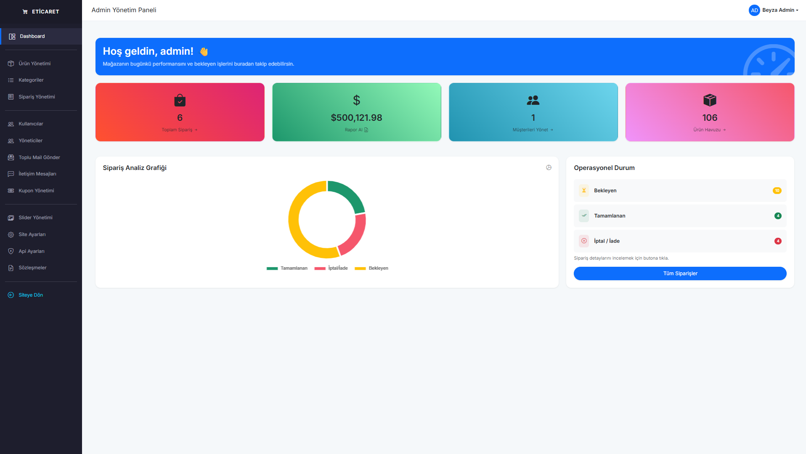
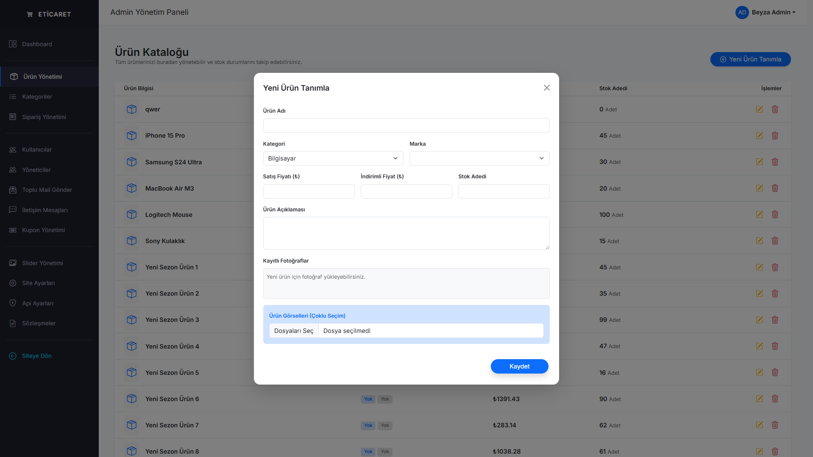
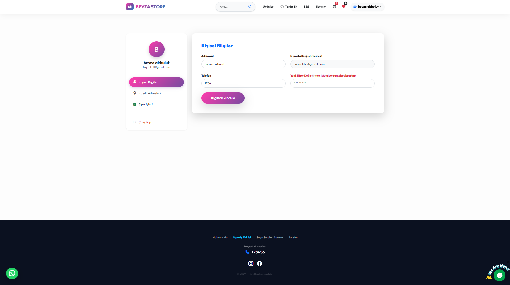
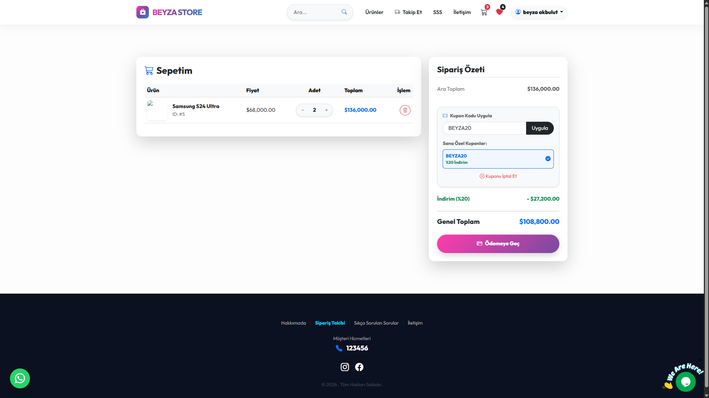
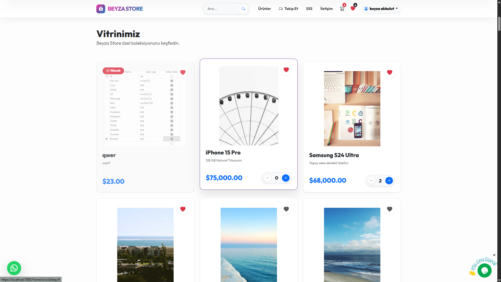

# 🛒 Advanced E-Commerce & Intelligent Inventory System

Bu proje, modern bir alışveriş platformu ile işletme sahipleri için kritik önem taşıyan **akıllı stok ve maliyet takip sistemini** birleştiren Full-Stack bir web uygulamasıdır. Standart e-ticaret özelliklerinin ötesinde, arka planda bir ERP (Kurumsal Kaynak Planlama) mantığıyla çalışan gelişmiş bir envanter yönetimi sunar.

---

## 📸 Proje Ekran Görüntüleri (Showcase)

  <h3>🛡️ Yönetim Paneli ve Akıllı Takip</h3>
  
  
  
<i>Sol: Genel Dashboard ve İstatistikler | Sağ: Kritik Stok ve Maliyet Takibi Ekranı</i>

  
   
  
  <h3>👤 Kullanıcı Deneyimi ve Profil</h3>
  
  
  
<i>Sol: Çoklu Adres Destekli Modern Profil | Sağ: Dinamik Sepet ve Kupon Algoritması</i>

  
   
  
  <h3>🛍️ Mağaza Vitrini</h3>
  
  
<i>Kullanıcıların karşılandığı, filtreleme ve kategorize edilmiş ürün vitrini.</i>

---

## 🚀 Öne Çıkan Mühendislik Çözümleri

### 📉 Akıllı Maliyet ve Stok Loglama (StokHareketleri)
Projenin en özgün ve teknik derinliği olan kısmı, ürünlerin alış fiyatlarındaki dalgalanmaları takip edebilmesidir.
* **Dinamik Fiyat Takibi:** Bir ürünün alış fiyatı güncellendiğinde (Örn: 5 TL'den 2 TL'ye düşüş), sistem bunu eski/yeni fiyat farkıyla birlikte `StokHareketleri` tablosuna otomatik olarak loglar.
* **Maliyet Analizi:** İşletme sahibine, ürünlerin zaman içindeki maliyet değişimlerini izleme ve kâr-zarar analizi yapma imkanı sunar.
* **Kritik Stok Uyarı Sistemi:** Belirlenen eşik değerin (KritikStok) altına düşen ürünler için yönetim panelinde interaktif görsel uyarılar oluşturulur.

### 🎫 Gelişmiş Kupon ve Kampanya Motoru
* **Kullanıcı Bazlı Kısıtlama:** İndirim kuponlarının belirli bir kullanıcıya özel veya genel kullanıma açık olması sağlanmıştır.
* **Kullanım Limiti Algoritması:** Bir kuponun toplamda kaç kez kullanılabileceği ve bir kullanıcının aynı kuponu kaç kere kullanabileceği sistem tarafından milisaniyeler içinde kontrol edilir.

### 📧 SMTP Mail Entegrasyonu
* **Otomatik Bilgilendirme:** Yeni üye kayıtlarında, şifre güncellemelerinde veya toplu kampanya duyurularında MailKit üzerinden profesyonel HTML şablonlu mailler gönderilir.

### 📍 Çoklu Adres ve Modern Profil Yönetimi
* **Adres Defteri:** Kullanıcıların hesaplarında birden fazla teslimat adresi (Ev, İş vb.) tanımlayabildiği ve yönetebildiği bir yapı kurulmuştur.
* **Güvenli Güncelleme:** Şifre, telefon ve kişisel bilgi güncellemeleri; Session güvenliği ve Anti-Forgery Token korumasıyla (CSRF koruması) stabilize edilmiştir.

---

## 🛠️ Teknik Yetkinlikler (Tech Stack)

* **Backend:** ASP.NET Core MVC 8.0 (C#)
* **Veritabanı:** Microsoft SQL Server & T-SQL
* **ORM:** Entity Framework Core (Database-First & Scaffold Approach)
* **Frontend:** Bootstrap 5, Razor Pages, CSS3 Custom Gradients, Animate.css, Bi-Icons
* **İletişim:** Tawk.to Live Chat entegrasyonu ve WhatsApp Business API yönlendirmesi.
* **Güvenlik:** Session-based Authentication, Model Validation, SQL Injection koruması.

---

## 🏗️ Veritabanı Mimarisi

Proje, ilişkisel veritabanı kurallarına (Normalization) uygun olarak tasarlanmıştır:
* `Urunler`: Temel ürün verileri, anlık alış ve satış fiyatları.
* `StokHareketleri`: Fiyat değişim logları ve stok devir geçmişi.
* `KullaniciAdresleri`: Kullanıcıya bağlı 1-n (bir-e-çok) ilişkiyle kurulmuş adres verileri.
* `Kuponlar`: Esnek indirim tanımları ve kullanım kısıtlamaları.

---

## 🚧 Geliştirme Süreci & Gelecek Planları (Roadmap)

Bu proje aktif olarak geliştirilmeye devam etmektedir. Mevcut altyapının üzerine eklenmesi planlanan güncellemeler:

- [ ] **📊 Gelişmiş Raporlama Paneli:** Satışların ve maliyetlerin Chart.js ile görselleştirilmesi.
- [ ] **📦 Kargo Entegrasyonu:** Siparişlerin kargo durumunun anlık API takibi.
- [ ] **💳 Ödeme Sistemi:** Sanal POS (Iyzico vb.) entegrasyonu.
- [ ] **⭐ Favoriler & Değerlendirme:** Kullanıcı yorum ve puanlama sistemi.
- [ ] **📱 PWA Desteği:** Mobil uygulama benzeri bir deneyim için Progressive Web App geliştirmeleri.

---

## 🔧 Kurulum ve Çalıştırma

1. Projeyi bilgisayarınıza clone'layın.
2. SQL Server üzerinde bir veritabanı oluşturun ve tabloları oluşturmak için gerekli sorguları çalıştırın.
3. `appsettings.json` dosyasındaki `ConnectionStrings` alanını kendi SQL bilgilerinizle güncelleyin.
4. Visual Studio üzerinden projeyi derleyip (Build) çalıştırın.

---
*Bu proje, **Beyza Akbulut** tarafından modern yazılım geliştirme standartları gözetilerek bir portfolyo çalışması olarak geliştirilmiştir.*
